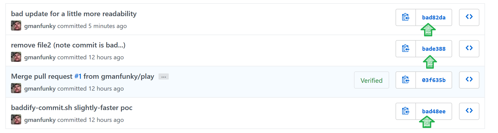

A test repo for screwing with git commit IDs

## baddify_commit.rb ##



### Usage ###
```console

$ git add baddify-commit.sh
$ git commit -m "bad update for a little more readability"

$ ruby baddify_commit.rb bad

   $ git push
   Counting objects: 3, done.
   Delta compression using up to 8 threads.
   Compressing objects: 100% (3/3), done.
   Writing objects: 100% (3/3), 578 bytes | 578.00 KiB/s, done.
   Total 3 (delta 1), reused 0 (delta 0)
   remote: Resolving deltas: 100% (1/1), completed with 1 local object.
   To https://github.com/gmanfunky/commit-vanity.git
      bad1388..bad82da  master -> master

```

Optionally use as a git hook
```shell
$ cp baddify_commit.rb .git/hooks/post-commit
```

### Performance ###
The ruby script is much more performant than the `.sh`. 

A chosen 5-hex-character desired prefix (e.g., `31337`) may only take a couple seconds to complete. For a longer prefix, multiply this by 16 for each additional character to get rough idea of how long it might take to complete. 

## Questions ##
- [ ] Can i add history before first null commit 000000000000 ?
- [ ] Stretch - Be able to "fixup" after a rebase. Changes all the commits to target. (e.g., `baddify-commits.sh HEAD^4`)
- [ ] Merge commits can have two parents. `gpgsig` after `committer` before message. Can we handle this? Can we achieve commit-vanity using additional bullshit parent commit?
- ~~[ ] Are there usable git libraries call quickly?~~ 
- [x] Can I add or remove files or various whitespace to calculate different pretty git commit SHA1?
- ~~Maybe use tons of file move commands to generate new commits? ~~
- ~~Maybe mess with the author info. Multiple author entries? Or timestamp changes. Or timestamp+timezone changes? (add to timestamp, change offset). ~~
- [x] Super dumb hack: just keep ammending last commit until getting what we want
- `git commit --allow-empty` allows same tree. Might be used to make a short story with SHA1?.
Doesn't trigger `post-commit`
- [x] How to cleanup stale objects? `git -c gc.reflogExpireUnreachable=0 -c gc.pruneExpire=now gc`
- [x] Generate and edit file directly? Read last commit, loop making new ones until ready to replace log
- [x] Maybe munge author (not committer) details. Author timestamp seems least noticable on github.com
- What happens on github is timezone is not recognized (e.g., +0111 or +0199 _gnarly!_)
  - for invalid offsets 60+ minutes, it seems git commandline will default to commit time?
  - Github seems to auto-fixup author date, and ignore committer date when displaying commit details. \
  so have fun with the commit time? 


## Hookify ##
Can copy to be the lesser-known `.git/hooks/post-commit` hook.

## Quick Math ##
```bash
# 3 base 16 digit permutations. Want something like "bad"
$ echo $((16 * 16 * 16))
4096
```

## Fun Short Hex Words ##
```
bad
fed
decaf
abe
dead
ca7 # caT?
d06 # Nice and trolly for them cat people?
abcd
ace
beef
face
babe
eff
effed
1337
00f
f00
fab # Code must be fabulous. ¯\_(ツ)_/¯
a11ace
babb1e
baddad
d0ab1e
d00dad
fa1afe1 (~1-8 minutes?). Save for the hsitory-rewrite feature.
```

Additional Reference: http://www.nsftools.com/tips/HexWords.htm

## How is a git commit sha1 formed ##
See https://gist.github.com/masak/2415865
```
$ (printf "commit %s\0" $(git cat-file commit HEAD | wc -c); git cat-file commit HEAD) | sha1sum.exe ; git log | head -1
dc9decb23a96ebc4090aee1df73d50f2c31f2e9c *-
commit b23e9b68becf18bad0c7649d04ddfc8e7af27b05
```

## Hacky PoC Commands ##
```
GIT_COMMITTER_DATE='2000-01-01T00:00:00+0000' git commit --date='2000-01-01T00:00:00+0000'
```
